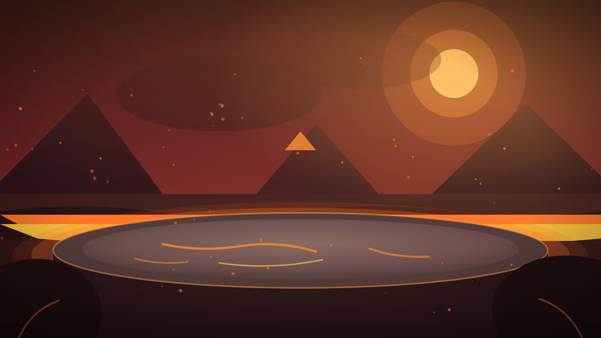
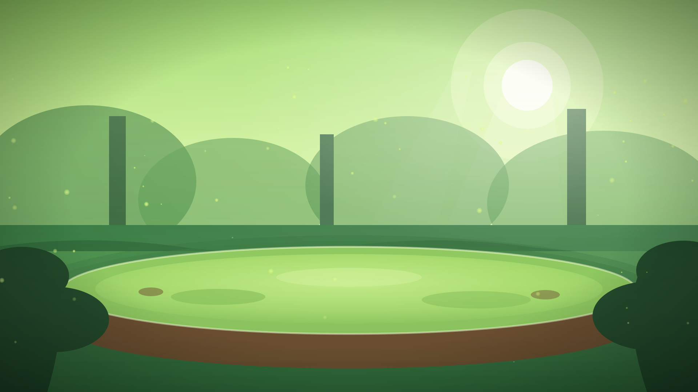

# The Ten-Page Notebook

## Page 1: Game Identity

- **Title:** Combo Tactics
- **Game System:** Turn-based RPG focused on squad management and alternating 1v1 tactical combat.
- **Target Audience:** Tactical RPG fans (14+ years), build optimization enthusiasts, and competitive PvP players.
- **Rating:** 14 years
- **Estimated Release Date:** November 2026

**Logo!**

---

## Page 2: Story and Game Flow

**Story Summary:** beginning, middle, and end.

**Game Flow:** clarify factors such as:

- **Characters:** 9 characters divided into 3 classes (Warrior, Mage, and Tank) and 3 elements (Fire, Water, and Plant).
- **Environment:** The battle arena is the game environment, it can change during the battle, between Sea, Volcano, Forest, and Moon.
- **Objectives:** In story mode, the objective is to duel with various opponents until you defeat the final boss.
- **Story Development:** You are a new duelist commanding a team of 3 characters and must defeat opponents on your way to eternal glory.
- **Types of challenges and how to solve them:** The game's challenges are the battles you have with opponents, in a 3 vs 3 character challenge. Whoever finishes off the opponent's characters first wins.
- **Skill Progression:** Each character has their attributes (HP, attack, defense, speed) and can evolve them in the store.
- **Items:** The player has the option to use an item during the round; possible items are Medical Kit, Medicine, Defense Potion, and Attack Potion.
- **Rewards:** By playing a battle, the player earns coins that can be exchanged for items and skill progression in the store.

---

## Page 3: Main Character

- **Who is the main character:** The duelist who commands the team of 3 characters. He represents the player commanding the battle.
- **Relevant features for the game:** The main character is not just a representation of the team's trainer.
- **Background:** He is an unknown rookie in the battles, arriving at the arena just to compete in the challenge.
- **How he got involved in the plot:** He entered the challenge by his own will, seeking the eternal glory of defeating the final boss.
- **Art:** The duelist is not shown; the stylized 2D cartoon art is applied to the 9 fighters and the arenas.
- **How the main character will be controlled:** He is not controlled in the three round actions (attack, use item, or switch character).

---

## Page 4: Gameplay and Necessary Resources

**Gameplay:**

- **Game Genre:** Turn-based tactical RPG, with squad management and alternating 1v1 duels.
- **Multiple characters:** There are 9 playable characters, and the player takes 3 per battle, rotating which one is active in the arena.
- **Level structure:** The story mode is a challenge of 4 consecutive battles: an opponent of each element (Fire, Water, and Plant) and the final boss.
- **Mini-games:** These are the battles outside the story mode, against the AI on a chosen difficulty or against another player.
- **Bonus stages:** The game has no bonus stages.

**Necessary Resources:**

- **Platform:** PC browser, no installation required.
- **Necessary components:** Keyboard and mouse, web browser, and internet.
- **Split-screen in multiplayer:** There is no split-screen; the multiplayer is local and both players take turns on the same device each round.
- **Camera movements:** Fixed side camera in the 2D arena, observing the 2 active characters.

---

## Page 5: World

**Images!**

- **Environments:** The arena is single and a draw every 3 rounds transforms its scenery between Sea, Volcano, Forest, and Moon.
    - **Sea:** Arena taken by water, which favors Water characters and disadvantages Fire characters.
    - **Volcano:** Lava arena, which favors Fire characters and disadvantages Plant characters.
    - **Forest:** Arena covered in vegetation, which favors Plant characters and disadvantages Water characters.
    - **Moon:** Low-gravity arena, which favors slow characters and disadvantages fast characters.
- **How environments relate to the story:** The game world is just the challenge arena.
- **Expected feelings from the player in each environment:** Casino tension, with relief when the drawn scenery favors the team and anxiety when it favors the opponent.
- **Map or diagram expected from the player about the environment:** The game has no map or exploration.

---

## Page 6: Gestalt — "feeling the game"

**What the game conveys with:**

- **Music:** Upbeat, light, and energetic, in the same tone as the 2D cartoon art and the monster duel.
- **Sounds:** The main elements are the voices and roars unique to each of the 9 fighters, giving personality to the creatures.
- **Camera work:** Fixed side camera in the 2D arena, focus on the character when using the special attack.
- **Opening scene:** The menu contains the Campaign, Multiplayer, and Store options in the art below.

**Types of Gestalt:**

- **Horror:** Absent, the game does not deal with fear or survival tension.
- **Hope:** The rookie's journey towards eternal glory, winning despite the odds.
- **Human:** The weight lies on the characters and the player's bond with their team of 3 fighters.
- **Electrifying:** Fast-paced turn adrenaline, dodge window, special attack, and draws turning the tide.
- **Forbidden:** The challenge and the bets set the tone of something underground.

---

## Page 7: Mechanics, hazards, power-ups, and collectibles

- **Mechanics**
    - **Turn actions:** Every turn, the player chooses between attacking, using an item, or switching the active character in the arena.
    - **Effectiveness:** Element and class advantages change damage, +30% for single advantage and +50% for double advantage.
    - **Stamina:** A bar that charges when dealing damage, taking damage, and defending successfully, unlocking the special attack when full.
    - **Dodge and counter-attack:** At the moment of the attack, the targeted user can dodge or counter-attack the opponent by clicking at the right moment.
    - **Arena draw:** Every 3 rounds, a casino draw changes the environment, favoring some characters and disadvantaging others.
    - **3-turn effects:** Special attacks can apply positive or negative effects on other characters.

- **Hazards:** The game has no hazards; all damage comes from battles.

**Power-ups:** The mechanics that help facilitate the game are: Items, Positive effects, Special attacks.

**Collectibles:** At the end of every battle, the player receives coins in return (50 upon defeat, 100 upon victory, and 500 for winning the tournament).

---

## Page 8: Enemies and Bosses

- **Enemies**

    - **Location:** The campaign is a trail where the user duels with 4 opponents with their teams; each opponent lives in a unique environment.
    - **Features:** The first 3 opponents battle with teams exclusive to each element, making the elemental weakness predictable.

- **Bosses**

    - **What makes them different?** The final boss is a veteran duelist who fights with a single exclusive and much stronger character, outside the 9 playable ones.
    - **Are they villains?** No, both the rivals and the boss are arena competitors fighting for the same eternal glory.
    - **Do they join your side?** No, the 9 characters are already unlocked from the beginning, so defeating an opponent only yields coins.

---

## Page 9: Unlockables and Multiplayer

**Extra elements that can be unlocked:**

- **Impact on replay:** The attribute evolution bought in the store is permanent and gives a reason to repeat battles accumulating coins.
- **How they are achieved:** The store sells items and evolutions in exchange for coins, and each campaign duelist is only unlocked after beating the previous stage.
- **Achieved inside or outside the game:** Everything is achieved inside the game, by battling and spending the coins earned in battles.

**Multiplayer:**

- **Will there be support?** Yes, local multiplayer is one of the game modes.
- **How many?** Two-player battle, one against the other with teams of 3 characters.
- **How do maps and shared elements behave?** Everything is shared on a single screen: team selection, arena, and scenery draw.
- **Player content creation:** The game has no character, arena, or rule editor.

---

## Page 10: Monetization

- **Free-to-play?** Yes, the game is free on the browser.
- **Pay to play the full version?** No, the entire campaign, multiplayer, and the 9 characters are unlocked without paying anything.
- **Pay to advance faster or unlock without playing?** Not in the MVP. Coin packages for items and evolutions are planned for after launch, once the game has accounts and a server to validate purchases.
- **Pay to have an advantage over other players?** Not in the MVP. If coin packages are added later, the advantage would be indirect (items and evolutions), and local PvP's Fair Mode keeps matches on base attributes.
- **Unlockable advertising?** The game has no ads, neither mandatory nor optional for rewards.
