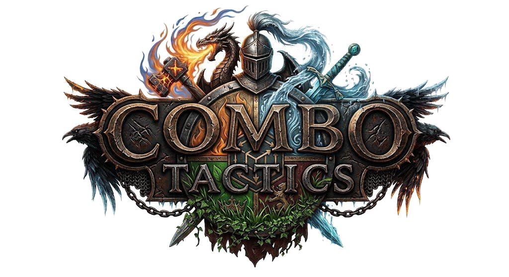
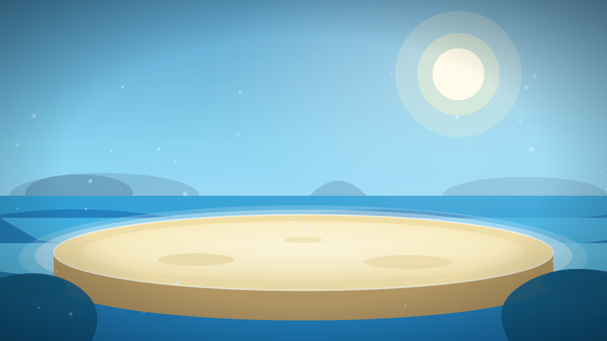
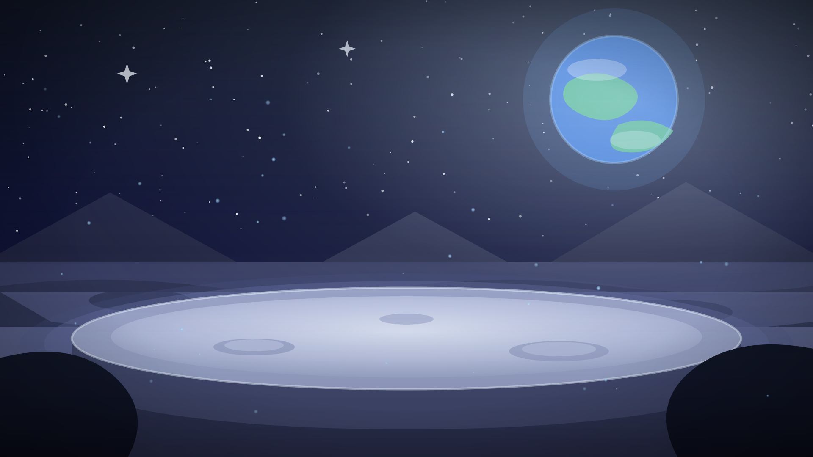
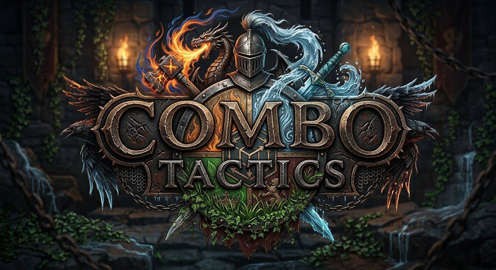

# O Caderno de Dez Páginas

## Página 1: Identidade do jogo

- **Título:** Combo Tactics
- **Sistema de jogo:** RPG de turno focado em gerenciamento de esquadrão e combate tático 1v1 alternado.
- **Público-alvo:** Fãs de RPG tático (+14 anos), entusiastas de otimização de builds e jogadores de PvP competitivo.
- **Classificação:** 14 anos
- **Data estimada de publicação:** Novembro de 2026

**Logo!**

---

## Página 2: História e fluxo do jogo

**Resumo da história do jogo:** começo, meio e fim.

**Fluxo do jogo:** deixar claro fatores como:

- **Personagens:** 9 personagens divididos entre 3 classes (Guerreiro, Mago e Tanque) e 3 elementos (Fogo, Água e Planta).
- **Ambiente:** A arena de batalha é o ambiente do jogo, ele pode mudar no decorrer da batalha, entre Mar, Vulcão, Floresta e Lua
- **Objetivos:** No modo história o objetivo é duelar com diversos oponentes até vencer boss final.
- **Desenvolvimento da história:** Você é um novo duelista que comanda uma equipe de 3 personagens e tem que ganhar de oponentes em rumo a glória eterna.
- **Tipos de desafios e como resolvê-los:** Os desafios do jogo são as batalhas que você tem com os oponentes, num desafio de 3 x 3 personagens. Quem acabar com os personagens do adversário primeiro vence.
- **Progressão de habilidades:** Cada personagem tem seus atributos (HP, ataque, defesa, velocide) e pode evoluí-los na loja.
- **Itens:** O jogador tem como opção usar um item na rodada, os itens possíveis são Kit Médico, Remédio, Poção de Defesa e Poção de Ataque.
- **Recompensas:** Ao jogar uma batalha o jogador ganha moedas que pode trocar por itens e progrssão de habilidades na loja.

---

## Página 3: Personagem principal

- **Quem é o personagem principal:** O duelista que comanda a equipe de 3 personagens. Ele representa o jogador que comanda a batalha.
- **Características relevantes ao jogo:** O personagem principal não é apenas uma representação do treinador da equipe.
- **Background:** É um novato deconhecido nas batalhas, que chega à arena apenas para disputar o desafio.
- **Como se envolveu na trama:** Entrou no desafio por vontade própria, em busca da glória eterna de vencer o boss final.
- **Arte:** O duelista não é mostrado; a arte cartoon 2D estilizada é aplicada aos 9 lutadores e às arenas.
- **Como o personagem principal será controlado:** Ele não é controlado nas três ações da rodada (atacar, usar item ou trocar de personagem).

---

## Página 4: Gameplay e recursos necessários

**Gameplay:**

- **Gênero do jogo:** RPG tático de turno, com gerenciamento de esquadrão e duelos 1v1 alternados.
- **Múltiplos personagens:** São 9 personagens jogáveis, e o jogador leva 3 por batalha, revezando qual está ativo na arena.
- **Estrutura dos níveis:** O modo história é um desafio de 4 batalhas seguidas: um oponente de cada elemento (Fogo, Água e Planta) e o boss final.
- **Mini-games:** São as batalhas fora do modo história, contra a IA em dificuldade escolhida ou contra outro jogador.
- **Fases bônus:** O jogo não tem fases bônus.

**Recursos necessários:**

- **Plataforma:** Navegador de PC, sem necessidade de instalação.
- **Componentes necessários:** Teclado e mouse, navegador web e internet.
- **Divisão de tela em multiplayer:** Não existe divisão de tela, o multiplayer é local e os dois jogadores revezam o mesmo aparelho a cada turno.
- **Movimentos de câmera:** Câmera fixa lateral na arena 2D, observando os 2 personagens ativos.

---

## Página 5: Mundo

**Imagens!**

- **Ambientes:** A arena é única e o sorteio a cada 3 rodadas transforma o cenário dela entre Mar, Vulcão, Floresta e Lua.
    - **Mar:** Arena tomada pela água, que favorece os personagens de Água e prejudica os de Fogo.
    - **Vulcão:** Arena de lava, que favorece os personagens de Fogo e prejudica os de Planta.
    - **Floresta:** Arena coberta de vegetação, que favorece os personagens de Planta e prejudica os de Água.
    - **Lua:** Arena de baixa gravidade, que favorece os personagens lentos e prejudica os rápidos.
- **Como os ambientes se relacionam à história:** O mundo do jogo é só a arena do desafio.
- **Sentimentos esperados sobre o jogador em cada ambiente:** Tensão de cassino, com alívio quando o cenário sorteado favorece a equipe e ansiedade quando favorece o oponente.
- **Mapa ou diagrama esperado do jogador sobre o ambiente:** O jogo não tem mapa nem exploração.

---

## Página 6: Gestalt — "sentindo o jogo"

**O que o jogo transmite com:**

- **Música:** Animada, leve e energética, no mesmo tom da arte cartoon 2D e do duelo de monstros.
- **Sons:** O principal são as vozes e os rugidos próprios de cada um dos 9 lutadores, que dão personalidade aos bichos.
- **Jogo de câmeras:** Câmera fixa lateral na arena 2D, foco no personagem quando usa o ataque especial.
- **Cena inicial:** O menu contém as opções Campanha, Multiplayer e Loja na arte abaixo.

**Tipos de Gestalt:**

- **Horror:** Ausente, o jogo não trabalha medo nem tensão de sobrevivência.
- **Esperança:** A jornada do novato rumo à glória eterna, vencendo apesar da desvantagem.
- **Humano:** O peso está nos personagens e no vínculo do jogador com sua equipe de 3 lutadores.
- **Eletrizante:** Adrenalina de turno rápido, janela de desvio, ataque especial e sorteio virando o jogo.
- **Proibido:** O desafio e as apostas dão o tom de algo clandestino.

---

## Página 7: Mecânicas, hazards, power ups e coletáveis

- **Mecânicas**
    - **Ações do turno:** A cada turno o jogador escolhe entre atacar, usar um item ou trocar o personagem ativo na arena.
    - **Efetividade:** Vantagem de elemento e de classe muda o dano, +30% por vantagem simples e +50% por vantagem dupla.
    - **Stamina:** Uma barra que carrega ao causar dano, sofrer dano e defender com sucesso, e libera o ataque especial quando enche.
    - **Desvio e contra-ataque:** No momento do ataque, o usuário que está sendo atacado pode desviar ou contra atacar o oponente clicando no momento certo.
    - **Sorteio da arena:** A cada 3 rodadas um sorteio de cassino troca o ambiente, favorecendo alguns personagens e prejudicando outros.
    - **Efeitos de 3 turnos:** Ataques especiais podem aplicar efeitos positivos ou negativos em outros personagens.

- **Hazards:** O jogo não tem hazards, todo o dano vem das batalhas.

**Power ups:** As mecânicas que ajudam facilitam o jogo são: Itens, Efeitos positivos, Ataques especiais

**Coletáveis:** Ao final de toda batalha o jogador recebe moedas em troca (50 na derrota, 100 na vitória e 500 ao ganhar o torneio).

---

## Página 8: Inimigos e chefões

- **Inimigos**

    - **Localização:** A campanha é uma trilha que o usuário duela com 4 adversários com suas equipes, cada adversário vive em um ambiente exclusivo.
    - **Características:** Os 3 primeiros adversários batalham com equipes exclusivas de cada elemento, o que deixa a fraqueza elemental previsível.

- **Chefões**

    - **O que os torna diferentes?** O boss final é um duelista veterano que luta com um único personagem exclusivo e muito mais forte, fora dos 9 jogáveis.
    - **São vilões?** Não, tanto os rivais quanto o boss são competidores da arena disputando a mesma glória eterna.
    - **Passam para o seu lado?** Não, os 9 personagens já estão liberados desde o início, então vencer um oponente rende apenas moedas.

---

## Página 9: Desbloqueáveis e multiplayer

**Elementos extras que podem ser desbloqueados:**

- **Impacto em replay:** A evolução de atributos comprada na loja é permanente e dá motivo para repetir batalhas acumulando moedas.
- **Como são atingidos:** A loja vende itens e evoluções em troca de moedas, e cada duelista da campanha só é liberado ao vencer a fase anterior.
- **Alcançado dentro ou fora do jogo:** Tudo é conquistado dentro do jogo, batalhando e gastando as moedas ganhas nas batalhas.

**Multiplayer:**

- **Vai ter suporte?** Sim, o multiplayer local é um dos modos de jogo.
- **Quantos?** Batalha de dois jogadores, um contra o outro com equipes de 3 personagens.
- **Como é o comportamento de mapas e coisas compartilhadas?** Tudo é compartilhado em uma tela só: a escolha da equipe, a arena e o sorteio de cenário.
- **Criação de conteúdo por jogadores:** O jogo não tem editor de personagem, de arena nem de regras.

---

## Página 10: Capitalização

- **Free-to-play?** Sim, o jogo é gratuito no navegador.
- **Paga para jogar a versão completa?** Não, a campanha inteira, o multiplayer e os 9 personagens estão liberados sem pagar nada.
- **Paga para avançar mais rápido ou desbloquear sem jogar?** Não no MVP. Pacotes de moedas para itens e evoluções estão previstos para depois do lançamento, quando o jogo tiver contas e um servidor para validar as compras.
- **Paga para ter vantagem sobre outros jogadores?** Não no MVP. Se os pacotes de moedas forem adicionados, a vantagem seria indireta (itens e evoluções), e o Modo Justo do PvP local mantém as partidas com atributos base.
- **Publicidade desbloqueável?** O jogo não tem anúncio, nem obrigatória nem opcional por recompensa. 
